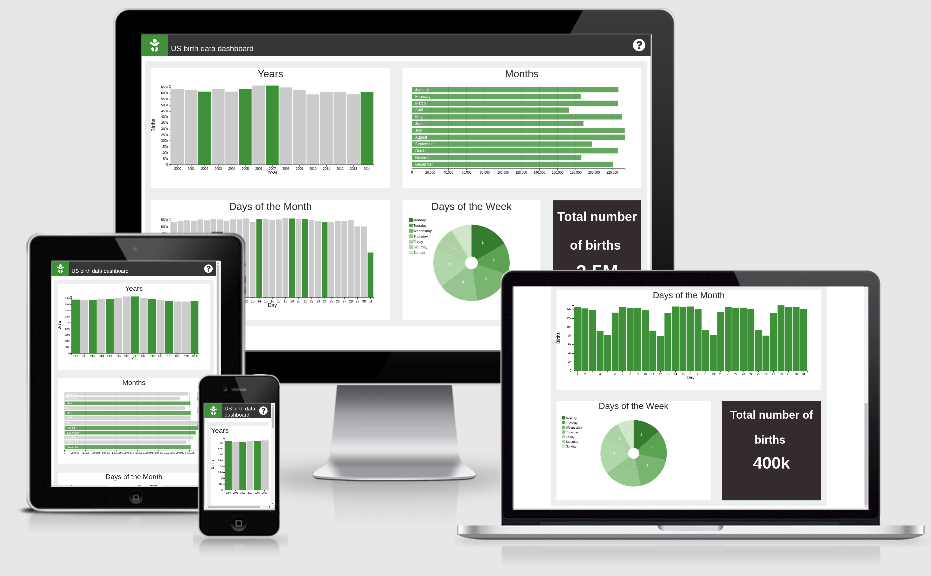

# US Birth Data Dashboard

The project is inspired by an article called [“Some people are too superstitious to have a baby on Friday the 13th](https://fivethirtyeight.com/features/some-people-are-too-superstitious-to-have-a-baby-on-friday-the-13th/) written by Carl Bialik. It takes shape of a single web page that reflects US births data (for the years 2000 to 2014) in the form of dynamic data dashboard. The dashboard enables the users to manipulate the information and in turn visualise corresponding statistics. The main purpose of this interactive data panel is not only to prove or contradict the aforementioned article, but also to answer any possible data related questions, hence to satisfy user needs. 

## UX
The UX in this project is focused on the webpage user’s questions regarding the US birth data. Therefore, the visitors are presented with four interactive charts which reflect four data dimensions namely Year, Month, Date and Day. It also contains number box that shows the total number of births depending on the selected time frames. Together, these five instruments enable the users to interactively ask questions such us “how many people celebrate their birthdays only once in four years?”.

In order to enhance user learn-ability every interactive element on the page is of the same color, namely green. Combining the elements this way suggest dashboard users that everything green on the screen is clickable and interactive. Green is the color of choice, since according to [Jennifer Bourn](https://www.bourncreative.com/meaning-of-the-color-green/) it is the color of life, growth and fertility, which clearly corresponds with the project theme.  

Users playing around with the charts might get stuck or simply change their minds regarding the questions. Therefore there is a reset button that brings all the charts to the original state. For those who are confused upon landing, help is only a click away. The question mark icon in the right upper corner, once clicked, brings up the explanation and a walkthrough.

## Features
* **Number Display chart.** Shows the total number of births depending on the selected combination of bars
* **Bar chart showing yearly births.** Each bar reflects the corresponding year’s data.
* **Row chart showing monthly births.** Each row reflects the corresponding month’s data.
* **Bar chart showing daily births.**  Each bar reflects  the corresponding day data.
* **Pie chart showing days of the week.** Each slice represents a day of the week.
* **Restart Icon button.** Resets all charts to their original state
* **Help icon button.** Provides explanation about the charts.

## Technologies used
* **Html5**
* **Css**
* **Javascript**
* **JQuery**
* **Bootstrap** (Modal pop up)

### Libraries
* **DC.js**.Simple yet powerful javascript library for data visualization and analysis in the browser and on mobile devices.
* **D3.js**. JavaScript library for manipulating documents based on data. Requaired for DC.js
* **Crossfilter**.Supports interaction with dataset. 

## Testing
* **HTML** The website has passed 3w.org markup validation.
* **JavaScript** Chrome developer tools have shown no errors.
* **Reset button** Resets the charts as intended
* **Help button** If clicked brings modal pop-up with instructions to the screen.
* **Charts** All charts respond to clicks and affects each other as expected. However on mobile screens the pie chart overlaps with the legend indicating days. This bug will be fixed in the next version release:).

## Responsiveness
 The website and the charts adjusts to different screen sizes. However, on the devices smaller that 610px the bars and the dimension numbers appear to overlap. Therefore, the decision was made to keep the charts bigger than 610px wide and implement horizontal scrolling.
Testing was done with Google Chrome developer tools and manually on different browsers and mobile devices.
**Browsers used:**
* Chrome Version 67.0.3396.62
* Cromium Version 76.0.3809.87
* Opera 62
* Firefox 68
* Microsoft Edge 42
**Mobile devices used:**
* iPhone 5 (Safari, Chrome)
* iPad (Safari, Crome)
* Nokia Lumia 830 (Internet Exploler, Chrome)
* Nokia 6.1 (Chrome)
* Samsung Galaxy Note 8 (Chrome)

 Deployment.
The website is published on github page at https://andriusci.github.io/Interactive-Front-End/

